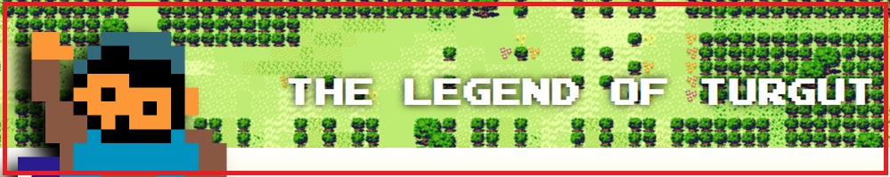
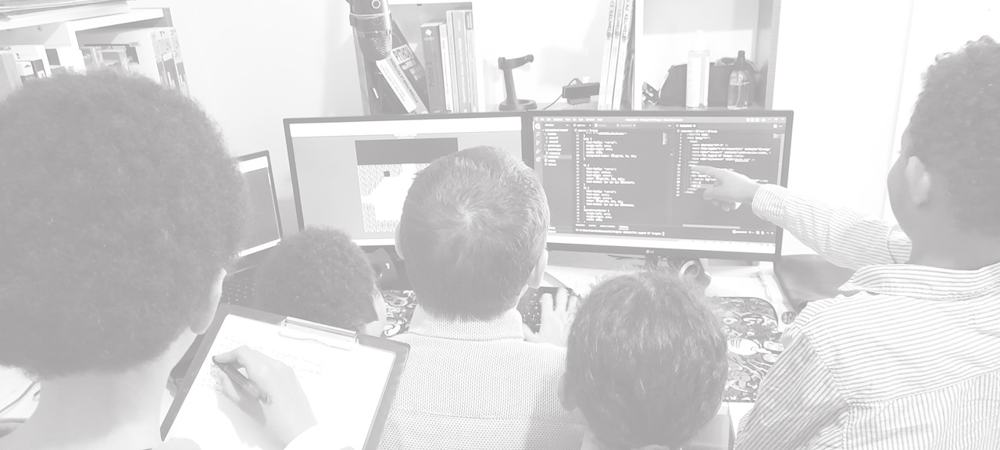
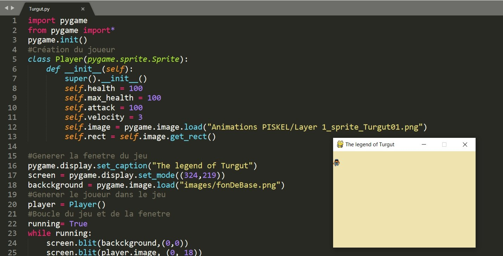
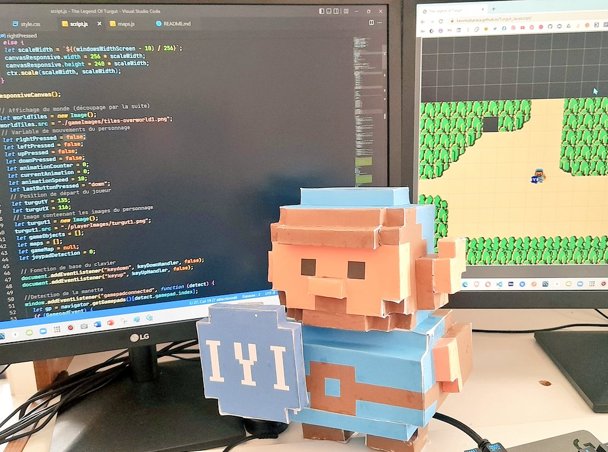

# ⚔️ The Legend Of Turgut ⚔️

## Le jeu d'aventure en pixel-art

### Présentation

"The Legend of Turgut" est un jeu développé en 🗡️ HTML, 🏹 CSS et 🪓 JavaScript, sans framework ni canvas. Comme un site web classique, il repose entièrement sur le DOM !

Passionné de programmation, j’ai voulu partager avec vous ce projet ludique, qui me permet de coder régulièrement. Après avoir expérimenté avec Phaser.js, Pygame et Unity, j’ai choisi de revenir à une version en pur JavaScript, un langage universel et directement accessible via le navigateur. Mes enfants ont grandement contribué à la conception des graphismes et des animations. Ils ont aussi participé à l’élaboration de l’histoire et des personnages. Initiés très tôt à la programmation, ils ont pu m’aider à développer et tester le jeu.

### LE JEU

A voir ici : [Découvrez-le ici : THE LEGEND OF TURGUT](https://kduchevreuil.github.io/The-Legend-Of-Turgut/)

    ⬆️---Cliquer sur le lien ou l'image !----⬆️

### Qui est Turgut ?

Turgut est un héros fictif originaire d’Anatolie, à l’époque où les peuples turcs vivaient encore en nomades. L’idée d’un jeu d’aventure s’est imposée naturellement : la Turquie, riche en histoire, est un cadre idéal pour un RPG.

J’ai opté pour un style pixel-art, inspiré du rétro-gaming, afin de me concentrer sur le développement tout en rendant hommage aux classiques du genre. Le personnage de Turgut a été conçu avec PISKEL, en m’inspirant de Link dans The Legend of Zelda, une référence incontournable des jeux d’aventure.

À l’époque, Zelda se jouait avec une manette à seulement deux boutons. Aujourd’hui, nous disposons de bien plus de possibilités, ce qui m’amène à intégrer de nouvelles mécaniques et fonctionnalités. Le défi est de rendre le jeu plus interactif, mais c’est aussi ce qui le rend passionnant à développer !
 

### L'équipe de travail

 

### D'où vient ce projet ?

Ce jeu est avant tout un projet personnel et familial. Mes enfants m’ont aidé à concevoir les graphismes, les événements du jeu et même le nom du personnage principal. En complément de nos activités créatives comme le dessin ou le papercraft, j’ai souhaité leur faire découvrir le codage et le développement web, un univers qu’ils comprennent désormais mieux.

 

 

Côté technique, ce jeu me permet de perfectionner mes compétences en JavaScript. Malgré les nombreuses versions et améliorations successives, l’objectif reste le même : optimiser le code et enrichir l’expérience de jeu.

 

### Mes réseaux sociaux

